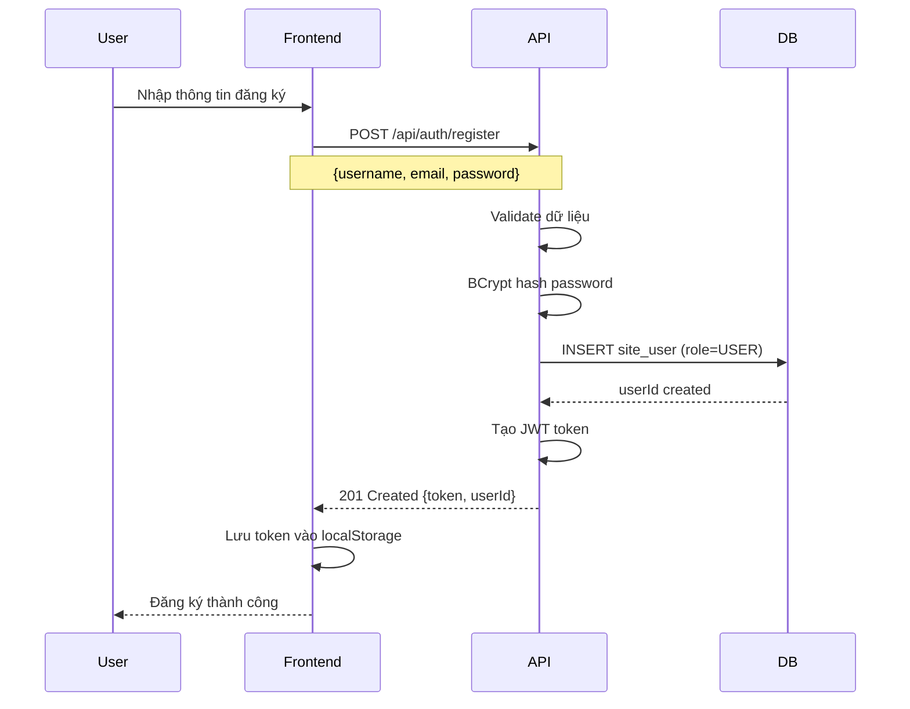
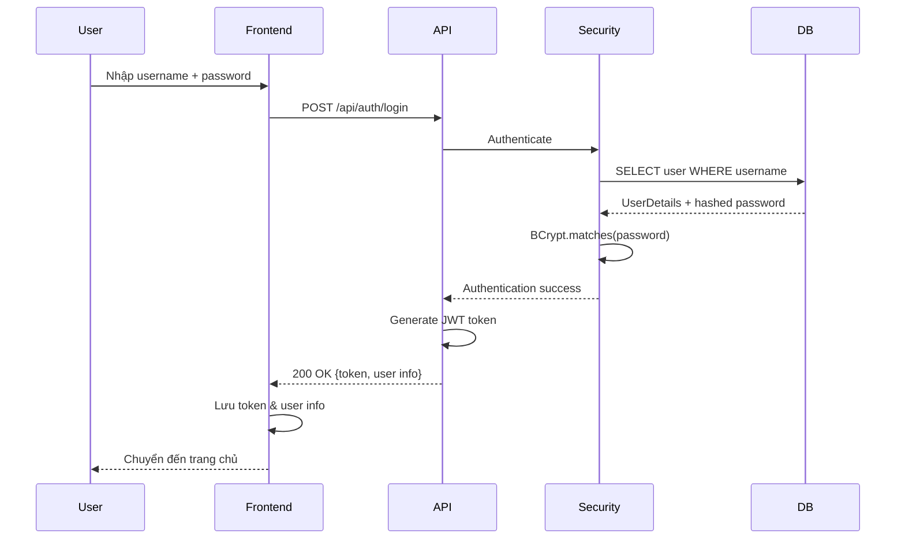
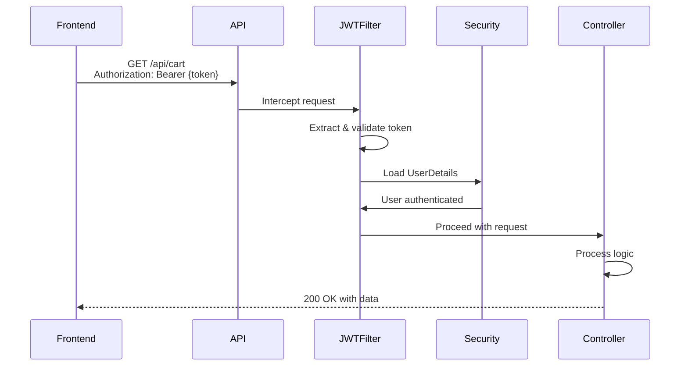

# 🎯 LUỒNG HOẠT ĐỘNG DỰ ÁN - CLOTHING STORE

> **Tài liệu mô tả chi tiết luồng hoạt động của hệ thống Clothing Store**  
> **Ngày tạo:** March 24, 2026

---

## 📋 MỤC LỤC

1. [Tổng Quan Hệ Thống](#1-tổng-quan-hệ-thống)
2. [Kiến Trúc Dữ Liệu](#2-kiến-trúc-dữ-liệu)
3. [Luồng Authentication](#3-luồng-authentication)
4. [Luồng Quản Lý Sản Phẩm](#4-luồng-quản-lý-sản-phẩm)
5. [Luồng Mua Hàng](#5-luồng-mua-hàng)
6. [Luồng Quản Lý Đơn Hàng](#6-luồng-quản-lý-đơn-hàng)
7. [Tích Hợp Frontend](#7-tích-hợp-frontend)

---

## 1. TỔNG QUAN HỆ THỐNG

### 🎯 Mô Tả Dự Án
**Clothing Store** là hệ thống thương mại điện tử bán quần áo trực tuyến với các tính năng:
- Quản lý sản phẩm đa biến thể (màu sắc, kích cỡ)
- Giỏ hàng và thanh toán
- Quản lý đơn hàng
- Phân quyền Admin/User

### 🏗️ Tech Stack
```
Frontend: React/Vue/Angular (chưa triển khai)
    ↕
Backend: Spring Boot 3.5.11 + Spring Security + JWT
    ↕
Database: MySQL 8.0 (23 tables)
```

### 🔐 Security
- **Authentication:** JWT Token (thời hạn 24 giờ)
- **Password:** BCrypt hashing
- **Authorization:** Role-based (USER, ADMIN)

---

## 2. KIẾN TRÚC DỮ LIỆU

### 📊 Mô Hình 3 Tầng Sản Phẩm

```
┌─────────────────────────────────────────────┐
│  PRODUCT (Sản phẩm gốc)                     │
│  - id, name, slug, description              │
│  - categoryId, basePrice                    │
│  - brand, material, isActive                │
└──────────────┬──────────────────────────────┘
               │ 1:N
               ▼
┌─────────────────────────────────────────────┐
│  PRODUCT_VARIANT (Biến thể theo màu)       │
│  - id, productId, colorId                   │
│  - variantImage, isActive                   │
└──────────────┬──────────────────────────────┘
               │ 1:N
               ▼
┌─────────────────────────────────────────────┐
│  VARIANT_STOCK (Tồn kho theo size)         │
│  - id, variantId, sizeId                    │
│  - sku, qtyInStock, priceOverride           │
└─────────────────────────────────────────────┘
```

### 💡 Ví Dụ Thực Tế

```
Sản phẩm: "Áo Thun Nike Basic"
├── basePrice: 250,000 VNĐ
├── category: "Áo Thun"
├── brand: "Nike"
│
├── Biến thể 1: Màu Đỏ (#FF0000)
│   ├── variantImage: "/uploads/ao-nike-red.jpg"
│   ├── Size S  → SKU: NIKE-RED-S  → stock: 10 → price: 250,000
│   ├── Size M  → SKU: NIKE-RED-M  → stock: 5  → price: 250,000
│   └── Size L  → SKU: NIKE-RED-L  → stock: 0  → price: 250,000 (Hết hàng)
│
└── Biến thể 2: Màu Xanh (#0000FF)
    ├── variantImage: "/uploads/ao-nike-blue.jpg"
    ├── Size S  → SKU: NIKE-BLU-S  → stock: 8  → price: 280,000 (override)
    └── Size M  → SKU: NIKE-BLU-M  → stock: 3  → price: 280,000 (override)
```

**Giải thích:**
- **basePrice:** Giá gốc của sản phẩm (250,000)
- **priceOverride:** Có thể thay đổi giá riêng cho từng SKU (size M màu xanh = 280,000)
- **finalPrice:** = priceOverride nếu có, ngược lại = basePrice
- **qtyInStock:** Số lượng tồn kho thực tế của từng SKU

---

## 3. LUỒNG AUTHENTICATION

### 📝 Đăng Ký Tài Khoản



### 🔓 Đăng Nhập



### 🔒 Sử Dụng API Bảo Mật



---

## 4. LUỒNG QUẢN LÝ SẢN PHẨM

### 🎨 Tạo Sản Phẩm Hoàn Chỉnh (Admin)

```
BƯỚC 1: Tạo Danh Mục (nếu chưa có)
POST /api/categories
{
  "name": "Áo Thun",
  "slug": "ao-thun",
  "parentId": 1,
  "description": "Áo thun các loại"
}
↓

BƯỚC 2: Tạo Màu Sắc (nếu chưa có)
POST /api/colors
{
  "name": "Đỏ",
  "hexCode": "#FF0000"
}
↓

BƯỚC 3: Tạo Sizes (nếu chưa có)
POST /api/sizes
{
  "name": "M",
  "type": "clothing",
  "sortOrder": 2
}
↓

BƯỚC 4: Tạo Sản Phẩm Gốc
POST /api/products
{
  "name": "Áo Thun Nike Basic",
  "slug": "ao-thun-nike-basic",
  "categoryId": 2,
  "basePrice": 250000,
  "brand": "Nike",
  "material": "Cotton 100%"
}
→ Nhận productId = 1
↓

BƯỚC 5: Tạo Biến Thể Màu
POST /api/product-variants
{
  "productId": 1,
  "colorId": 1,  // Màu Đỏ
  "variantImage": "/uploads/nike-red.jpg"
}
→ Nhận variantId = 1
↓

BƯỚC 6: Tạo Tồn Kho Theo Size
POST /api/variant-stocks
{
  "variantId": 1,
  "sizeId": 1,  // Size S
  "sku": "NIKE-RED-S",
  "qtyInStock": 10,
  "priceOverride": null
}

Lặp lại cho Size M, L, XL...
↓

BƯỚC 7: Lặp lại BƯỚC 5-6 cho các màu khác
(Màu Xanh, Màu Đen, v.v.)
```

### 🔍 Hiển Thị Sản Phẩm (Frontend)

```javascript
// BƯỚC 1: Load danh sách sản phẩm (trang chủ)
GET /api/products/paged?page=0&size=12&sortBy=createdAt&direction=DESC
→ Hiển thị thumbnail, tên, giá

// BƯỚC 2: User click vào sản phẩm
GET /api/products/slug/ao-thun-nike-basic
→ Lấy thông tin chi tiết

// BƯỚC 3: Load các màu sắc có sẵn
GET /api/product-variants/product/1
→ Hiển thị color picker (Đỏ, Xanh, Đen...)

// BƯỚC 4: User chọn màu Đỏ → Load sizes
GET /api/variant-stocks/variant/1
→ Hiển thị: [S: 10, M: 5, L: Hết hàng]

// BƯỚC 5: User chọn Size M
→ Hiển thị giá: 250,000 VNĐ
→ Enable nút "Thêm vào giỏ"
→ Lưu variantStockId = 2
```

---

## 5. LUỒNG MUA HÀNG

### 🛒 Quy Trình Mua Hàng Đầy Đủ

```
┌─────────────────────────────────────────────┐
│ 1. DUYỆT SẢN PHẨM                           │
│    - Xem danh sách sản phẩm                 │
│    - Tìm kiếm, lọc theo danh mục/giá/màu    │
│    - Vào trang chi tiết                     │
└──────────────┬──────────────────────────────┘
               ▼
┌─────────────────────────────────────────────┐
│ 2. CHỌN BIẾN THỂ                            │
│    - Chọn màu sắc                           │
│    - Chọn kích cỡ                           │
│    - Xem giá cuối cùng                      │
│    - Kiểm tra tồn kho                       │
└──────────────┬──────────────────────────────┘
               ▼
┌─────────────────────────────────────────────┐
│ 3. THÊM VÀO GIỎ HÀNG                        │
│    POST /api/cart/items                     │
│    {variantStockId, qty}                    │
│    → Cart tự động cộng nếu đã có            │
└──────────────┬──────────────────────────────┘
               ▼
┌─────────────────────────────────────────────┐
│ 4. XEM & CẬP NHẬT GIỎ HÀNG                  │
│    GET /api/cart                            │
│    - Xem danh sách items                    │
│    - Thay đổi số lượng (PUT)                │
│    - Xóa sản phẩm (DELETE)                  │
└──────────────┬──────────────────────────────┘
               ▼
┌─────────────────────────────────────────────┐
│ 5. THANH TOÁN                               │
│    a. Chọn địa chỉ giao hàng                │
│       GET /api/addresses                    │
│    b. Chọn phương thức vận chuyển           │
│       GET /api/shipping-methods             │
│    c. Chọn phương thức thanh toán           │
│       GET /api/payment-types                │
└──────────────┬──────────────────────────────┘
               ▼
┌─────────────────────────────────────────────┐
│ 6. ĐẶT HÀNG                                 │
│    POST /api/orders                         │
│    {paymentTypeId, shippingAddressId,       │
│     shippingMethodId, note}                 │
│    → Hệ thống:                              │
│      • Tạo đơn hàng (status = PENDING)      │
│      • Trừ tồn kho                          │
│      • Làm trống giỏ hàng                   │
│      • Tạo QR code (nếu chuyển khoản)       │
└──────────────┬──────────────────────────────┘
               ▼
┌─────────────────────────────────────────────┐
│ 7. XÁC NHẬN & THANH TOÁN                    │
│    - Hiển thị thông tin đơn hàng            │
│    - Hiển thị QR code (nếu chuyển khoản)    │
│    - Thông báo đặt hàng thành công          │
└─────────────────────────────────────────────┘
```

### 💳 Chi Tiết Thanh Toán

#### Phương thức 1: Chuyển Khoản Ngân Hàng
```javascript
// Response sau khi đặt hàng
{
  "orderId": 100,
  "orderCode": "ORD-20260324-100",
  "qrUrl": "https://img.vietqr.io/image/VCB-1234567890-compact2.jpg?...",
  "bankInfo": {
    "bankName": "Vietcombank",
    "accountNumber": "1234567890",
    "accountName": "NGUYEN VAN A",
    "branch": "Chi nhánh Hà Nội"
  },
  "orderTotal": 470000
}
```

**Frontend hiển thị:**
- QR code để scan
- Thông tin tài khoản để chuyển khoản thủ công
- Nội dung chuyển khoản: `ORD-20260324-100`

#### Phương thức 2: COD (Tiền Mặt)
```javascript
{
  "orderId": 101,
  "orderCode": "ORD-20260324-101",
  "paymentTypeName": "COD (Tiền mặt)",
  "orderTotal": 470000
}
```

**Frontend hiển thị:**
- Thông báo: "Thanh toán khi nhận hàng"
- Hướng dẫn: "Vui lòng chuẩn bị 470.000đ khi nhận hàng"

---

## 6. LUỒNG QUẢN LÝ ĐỚN HÀNG

### 👤 USER: Theo Dõi Đơn Hàng

```
┌─────────────────────────────────────────────┐
│ Xem Lịch Sử Đơn Hàng                        │
│ GET /api/orders                             │
│ → Danh sách tất cả đơn hàng                 │
└──────────────┬──────────────────────────────┘
               ▼
┌─────────────────────────────────────────────┐
│ Xem Chi Tiết 1 Đơn Hàng                     │
│ GET /api/orders/{orderId}                   │
│ → Thông tin chi tiết + tracking             │
└──────────────┬──────────────────────────────┘
               ▼
┌─────────────────────────────────────────────┐
│ Hủy Đơn (nếu status = PENDING)              │
│ PATCH /api/orders/{orderId}/cancel          │
│ → Hoàn trả tồn kho                          │
└─────────────────────────────────────────────┘
```

### 👨‍💼 ADMIN: Xử Lý Đơn Hàng

```
┌─────────────────────────────────────────────┐
│ Xem Tất Cả Đơn Hàng                         │
│ GET /api/orders/admin/all?page=0&size=20    │
└──────────────┬──────────────────────────────┘
               ▼
┌─────────────────────────────────────────────┐
│ Lọc Theo Trạng Thái                         │
│ GET /api/orders/admin/by-status/1           │
│ (1=PENDING, 2=PROCESSING, 3=SHIPPED...)     │
└──────────────┬──────────────────────────────┘
               ▼
┌─────────────────────────────────────────────┐
│ Cập Nhật Trạng Thái                         │
│ PATCH /api/orders/admin/{id}/status         │
│ {statusId: 2}  // PENDING → PROCESSING      │
└─────────────────────────────────────────────┘
```

### 📊 Vòng Đời Đơn Hàng

```
PENDING (Chờ xử lý)
    │
    │ Admin xác nhận
    ▼
PROCESSING (Đang xử lý)
    │
    │ Admin đóng gói & giao cho đơn vị vận chuyển
    ▼
SHIPPED (Đang giao hàng)
    │
    │ Khách hàng nhận hàng & xác nhận
    ▼
DELIVERED (Đã giao hàng)


Hoặc:
    │
    │ User/Admin hủy đơn
    ▼
CANCELLED (Đã hủy)
→ Hoàn trả tồn kho
```

---

## 7. TÍCH HỢP FRONTEND

### 🎨 Component Structure (Gợi Ý)

```
src/
├── components/
│   ├── auth/
│   │   ├── LoginForm.jsx
│   │   ├── RegisterForm.jsx
│   │   └── ProtectedRoute.jsx
│   │
│   ├── products/
│   │   ├── ProductList.jsx
│   │   ├── ProductCard.jsx
│   │   ├── ProductDetail.jsx
│   │   ├── ColorSelector.jsx
│   │   └── SizeSelector.jsx
│   │
│   ├── cart/
│   │   ├── CartPage.jsx
│   │   ├── CartItem.jsx
│   │   └── CartSummary.jsx
│   │
│   ├── checkout/
│   │   ├── CheckoutPage.jsx
│   │   ├── AddressSelector.jsx
│   │   ├── PaymentSelector.jsx
│   │   └── OrderSummary.jsx
│   │
│   └── orders/
│       ├── OrderList.jsx
│       ├── OrderDetail.jsx
│       └── OrderStatus.jsx
│
├── services/
│   ├── api.js          // Axios instance với interceptors
│   ├── authService.js
│   ├── productService.js
│   ├── cartService.js
│   └── orderService.js
│
├── store/              // Redux/Zustand
│   ├── authSlice.js
│   ├── cartSlice.js
│   └── productSlice.js
│
└── utils/
    ├── constants.js
    ├── formatters.js
    └── validators.js
```

### 🔧 Setup API Client (Axios)

```javascript
// services/api.js
import axios from 'axios';

const api = axios.create({
  baseURL: 'http://160.30.113.40:8080/api',
  headers: {
    'Content-Type': 'application/json'
  }
});

// Request interceptor - Tự động thêm token
api.interceptors.request.use(
  (config) => {
    const token = localStorage.getItem('accessToken');
    if (token) {
      config.headers.Authorization = `Bearer ${token}`;
    }
    return config;
  },
  (error) => Promise.reject(error)
);

// Response interceptor - Xử lý token hết hạn
api.interceptors.response.use(
  (response) => response.data, // Tự động unwrap data
  (error) => {
    if (error.response?.status === 401) {
      localStorage.removeItem('accessToken');
      localStorage.removeItem('user');
      window.location.href = '/login';
    }
    return Promise.reject(error);
  }
);

export default api;
```

### 📝 Example: Product Detail Page

```javascript
// ProductDetailPage.jsx
import { useState, useEffect } from 'react';
import api from '../services/api';

function ProductDetailPage({ slug }) {
  const [product, setProduct] = useState(null);
  const [variants, setVariants] = useState([]);
  const [selectedVariant, setSelectedVariant] = useState(null);
  const [stocks, setStocks] = useState([]);
  const [selectedStock, setSelectedStock] = useState(null);

  useEffect(() => {
    loadProduct();
  }, [slug]);

  async function loadProduct() {
    // 1. Load product info
    const productData = await api.get(`/products/slug/${slug}`);
    setProduct(productData);

    // 2. Load variants (colors)
    const variantsData = await api.get(`/product-variants/product/${productData.id}`);
    setVariants(variantsData);

    // 3. Load stocks of first variant
    if (variantsData.length > 0) {
      loadStocks(variantsData[0].id);
      setSelectedVariant(variantsData[0]);
    }
  }

  async function loadStocks(variantId) {
    const stocksData = await api.get(`/variant-stocks/variant/${variantId}`);
    setStocks(stocksData);
  }

  async function handleColorChange(variant) {
    setSelectedVariant(variant);
    setSelectedStock(null);
    await loadStocks(variant.id);
  }

  async function handleAddToCart() {
    if (!selectedStock) {
      alert('Vui lòng chọn size');
      return;
    }

    try {
      await api.post('/cart/items', {
        variantStockId: selectedStock.id,
        qty: 1
      });
      alert('Đã thêm vào giỏ hàng!');
    } catch (error) {
      alert(error.response?.data?.message || 'Có lỗi xảy ra');
    }
  }

  return (
    <div>
      <h1>{product?.name}</h1>
      <p>{product?.description}</p>

      {/* Color Selector */}
      <div>
        {variants.map(v => (
          <button 
            key={v.id}
            onClick={() => handleColorChange(v)}
            style={{
              backgroundColor: v.colorHex,
              border: selectedVariant?.id === v.id ? '3px solid black' : 'none'
            }}
          >
            {v.colorName}
          </button>
        ))}
      </div>

      {/* Size Selector */}
      <div>
        {stocks.map(s => (
          <button
            key={s.id}
            onClick={() => setSelectedStock(s)}
            disabled={s.qtyInStock === 0}
            style={{
              border: selectedStock?.id === s.id ? '2px solid blue' : '1px solid gray',
              opacity: s.qtyInStock === 0 ? 0.5 : 1
            }}
          >
            {s.sizeName} {s.qtyInStock === 0 && '(Hết hàng)'}
          </button>
        ))}
      </div>

      {/* Price & Add to Cart */}
      <div>
        <p>Giá: {selectedStock?.finalPrice?.toLocaleString('vi-VN')}đ</p>
        <button 
          onClick={handleAddToCart}
          disabled={!selectedStock || selectedStock.qtyInStock === 0}
        >
          Thêm vào giỏ hàng
        </button>
      </div>
    </div>
  );
}
```

---

## 🎯 CHECKLIST TÍCH HỢP

### Phase 1: Authentication
- [ ] Implement Login Form
- [ ] Implement Register Form
- [ ] Store JWT token in localStorage
- [ ] Setup Axios interceptors
- [ ] Implement Protected Routes
- [ ] Handle token expiration

### Phase 2: Product Catalog
- [ ] Product List with pagination
- [ ] Product search & filter
- [ ] Product detail page
- [ ] Color selector component
- [ ] Size selector component
- [ ] Category navigation

### Phase 3: Shopping Cart
- [ ] Cart page
- [ ] Add to cart functionality
- [ ] Update quantity
- [ ] Remove item
- [ ] Cart badge/counter

### Phase 4: Checkout
- [ ] Address management (CRUD)
- [ ] Checkout flow
- [ ] Payment method selection
- [ ] Shipping method selection
- [ ] Order confirmation page
- [ ] Display QR code for bank transfer

### Phase 5: Order Management
- [ ] Order history page
- [ ] Order detail page
- [ ] Order tracking
- [ ] Cancel order functionality
- [ ] Admin order management (if applicable)

---

## 📞 HỖ TRỢ

### 📚 Tài Liệu Tham Khảo
- **API Guide:** `FRONTEND_API_GUIDE.md`
- **Swagger UI:** http://160.30.113.40:8080/swagger-ui.html
- **Database Schema:** `DATABASE_ANALYSIS.md`
- **Product Flow:** `PRODUCT_CREATION_FLOW.md`

### 🐛 Debug & Testing
- **Health Check:** `GET /actuator/health`
- **Test Auth:** Dùng Postman/Insomnia để test các endpoint
- **Browser DevTools:** Kiểm tra Network tab để xem request/response

### 💡 Tips
1. Luôn kiểm tra token trước khi gọi protected API
2. Handle loading state và error state
3. Validate input trước khi submit
4. Cache dữ liệu static (categories, colors, sizes)
5. Implement debounce cho search

---

**Happy Coding! 🚀**

